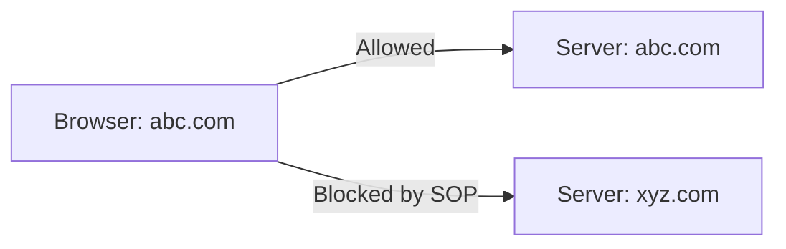
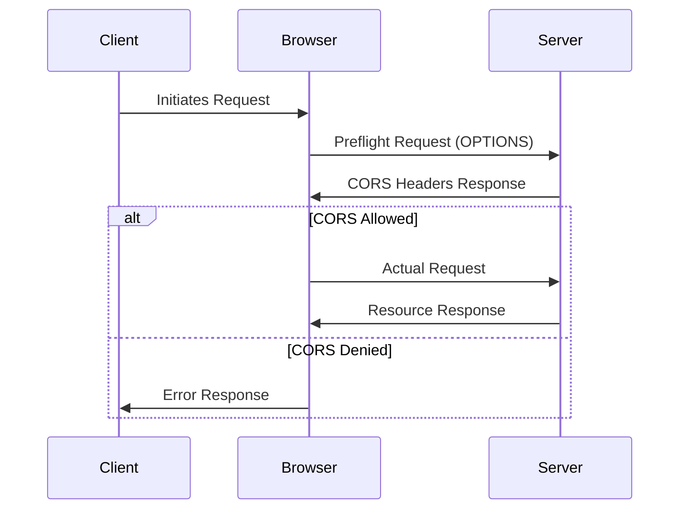

# Understanding CORS (Cross-Origin Resource Sharing)

## Overview

Cross-Origin Resource Sharing (CORS) is a critical security standard that enables servers to specify which browsers and origins can access their resources. It works in conjunction with the Same-Origin Policy (SOP) to create a secure browsing environment while allowing legitimate cross-origin requests when necessary.

## Same-Origin Policy (SOP)

The Same-Origin Policy is a fundamental browser security mechanism that restricts how documents and scripts from one origin can interact with resources from another origin. An origin consists of:
- Protocol (e.g., http/https)
- Domain
- Port number

### Example of SOP in Action

## How CORS Works

CORS enables controlled access to resources located outside the original domain. Here's a simple analogy to understand CORS:

> Think of CORS like a building's security system:
> - The delivery person (browser request) arrives at the building
> - Security guard (CORS) checks with the resident (server) before allowing entry
> - The resident (server) either approves or denies access

### CORS Request Flow

## Important CORS Headers

### Request Headers

| Header Name | Description | Example |
|------------|-------------|---------|
| Origin | The requesting domain | `Origin: https://abc.com` |
| Access-Control-Request-Method | HTTP method to be used | `Access-Control-Request-Method: POST` |
| Access-Control-Request-Headers | List of headers to be used | `Access-Control-Request-Headers: Content-Type` |

### Response Headers

| Header Name | Description | Example |
|------------|-------------|---------|
| Access-Control-Allow-Origin | Allowed origins | `Access-Control-Allow-Origin: https://abc.com` |
| Access-Control-Allow-Methods | Allowed HTTP methods | `Access-Control-Allow-Methods: GET, POST` |
| Access-Control-Allow-Headers | Allowed headers | `Access-Control-Allow-Headers: Content-Type` |

## Key Points to Remember

1. CORS is a browser-based security feature
   - Not applicable to mobile applications or server-to-server communications
   - Only enforced by web browsers

2. Preflight Requests
   - Sent automatically by the browser using OPTIONS method
   - Happens before the actual request
   - Allows servers to approve or deny the upcoming request

3. Security Benefits
   - Prevents unauthorized cross-origin access
   - Protects against Cross-Site Request Forgery (CSRF)
   - Gives servers fine-grained control over resource access

## Common Use Cases

1. API Access
   - Frontend applications accessing backend APIs
   - Third-party service integration
   - Microservices architecture

2. Resource Sharing
   - Loading images from CDNs
   - Accessing fonts from different domains
   - Fetching JSON data from external APIs

## Best Practices

1. Security
   - Never use `Access-Control-Allow-Origin: *` in production for sensitive data
   - Explicitly list allowed origins
   - Minimize the number of allowed methods and headers

2. Performance
   - Cache preflight responses when possible
   - Configure appropriate timing headers
   - Monitor CORS-related errors in production

## Troubleshooting

Common CORS errors and their solutions:

1. "No 'Access-Control-Allow-Origin' header is present"
   - Configure server to send proper CORS headers
   - Verify the requesting origin is allowed

2. "Method not allowed"
   - Add required HTTP method to Access-Control-Allow-Methods

3. "Headers not allowed"
   - Add required headers to Access-Control-Allow-Headers
