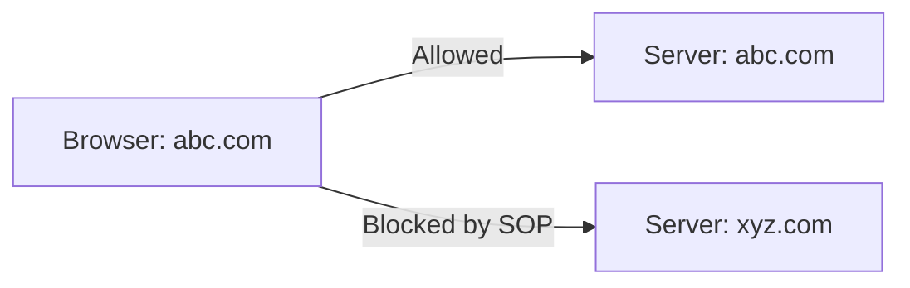
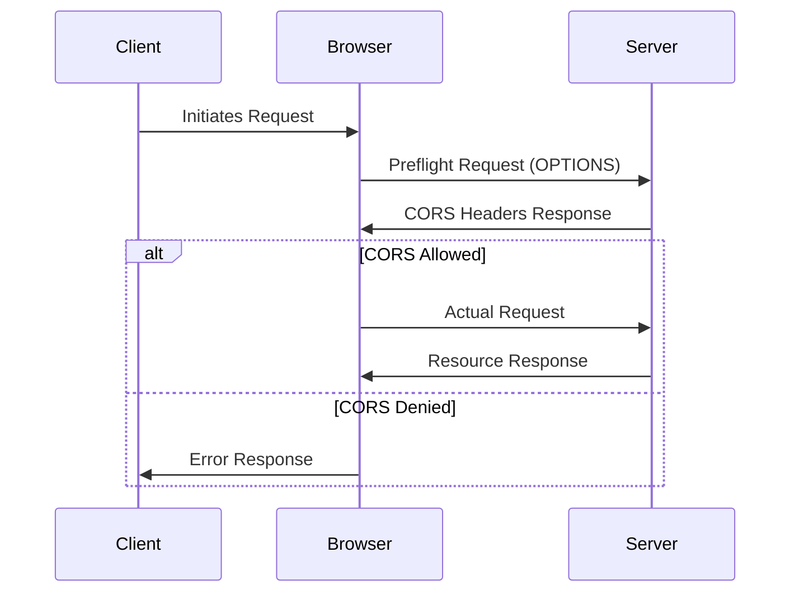
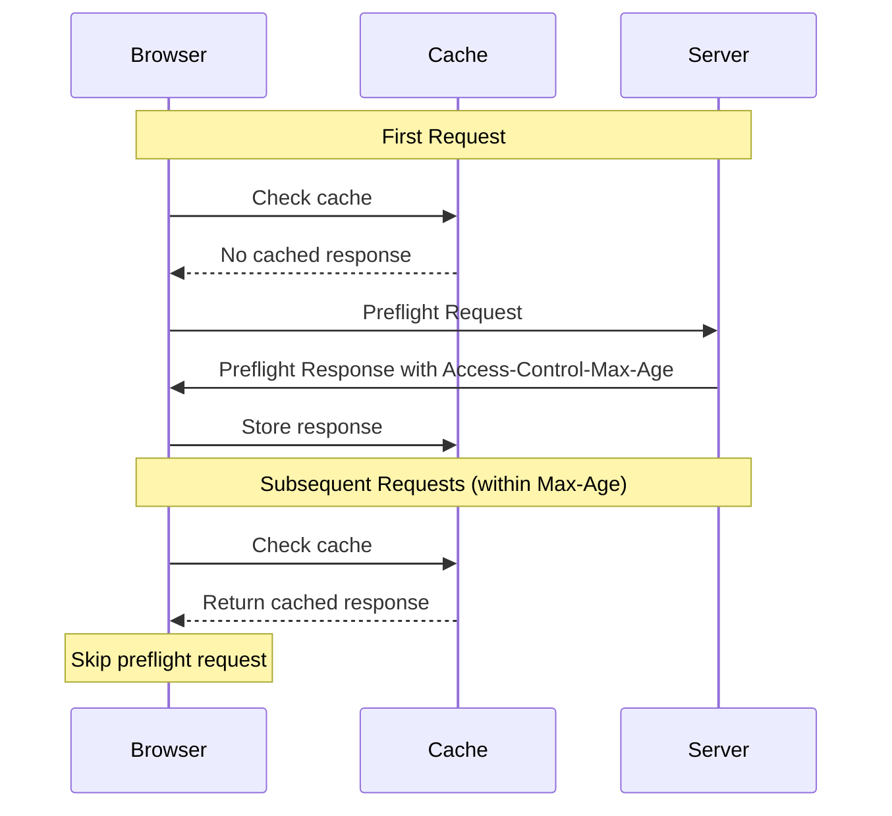
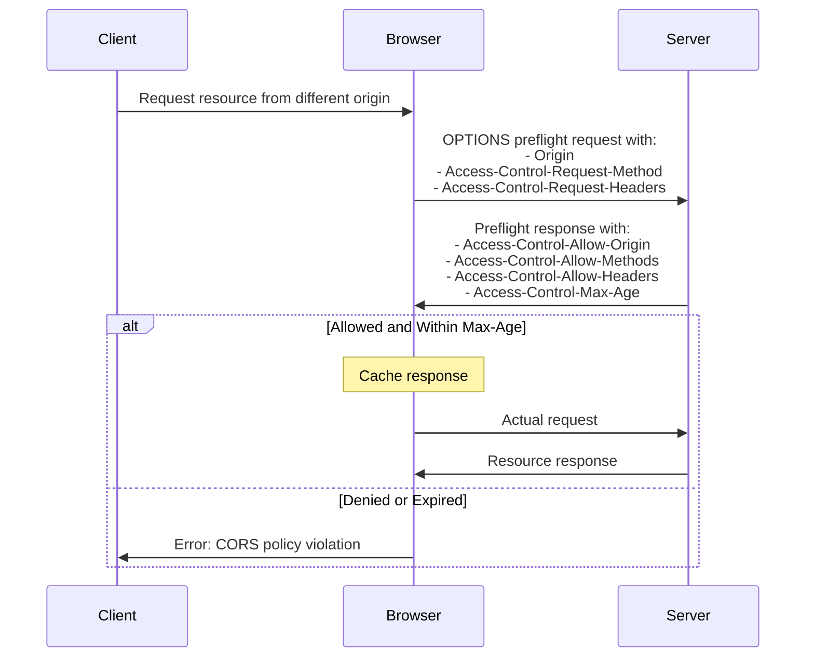

# Understanding CORS (Cross-Origin Resource Sharing)

## Overview

Cross-Origin Resource Sharing (CORS) is a critical security standard that enables servers to specify which browsers and origins can access their resources. It works in conjunction with the Same-Origin Policy (SOP) to create a secure browsing environment while allowing legitimate cross-origin requests when necessary.

## Same-Origin Policy (SOP)

The Same-Origin Policy is a fundamental browser security mechanism that restricts how documents and scripts from one origin can interact with resources from another origin. An origin consists of:
- Protocol (e.g., http/https)
- Domain
- Port number

### Example of SOP in Action



## How CORS Works

CORS enables controlled access to resources located outside the original domain. Here's a simple analogy to understand CORS:

> Think of CORS like a building's security system:
> - The delivery person (browser request) arrives at the building
> - Security guard (CORS) checks with the resident (server) before allowing entry
> - The resident (server) either approves or denies access

### CORS Request Flow



## Important CORS Headers

### Request Headers

| Header Name | Description | Example |
|------------|-------------|---------|
| Origin | The requesting domain | `Origin: https://abc.com` |
| Access-Control-Request-Method | HTTP method to be used | `Access-Control-Request-Method: POST` |
| Access-Control-Request-Headers | List of headers to be used | `Access-Control-Request-Headers: Content-Type` |

### Response Headers

| Header Name | Description | Example |
|------------|-------------|---------|
| Access-Control-Allow-Origin | Allowed origins | `Access-Control-Allow-Origin: https://abc.com` |
| Access-Control-Allow-Methods | Allowed HTTP methods | `Access-Control-Allow-Methods: GET, POST` |
| Access-Control-Allow-Headers | Allowed headers | `Access-Control-Allow-Headers: Content-Type` |

## Key Points to Remember

1. CORS is a browser-based security feature
   - Not applicable to mobile applications or server-to-server communications
   - Only enforced by web browsers

2. Preflight Requests
   - Sent automatically by the browser using OPTIONS method
   - Happens before the actual request
   - Allows servers to approve or deny the upcoming request

3. Security Benefits
   - Prevents unauthorized cross-origin access
   - Protects against Cross-Site Request Forgery (CSRF)
   - Gives servers fine-grained control over resource access

## Common Use Cases

1. API Access
   - Frontend applications accessing backend APIs
   - Third-party service integration
   - Microservices architecture

2. Resource Sharing
   - Loading images from CDNs
   - Accessing fonts from different domains
   - Fetching JSON data from external APIs

## Best Practices

1. Security
   - Never use `Access-Control-Allow-Origin: *` in production for sensitive data
   - Explicitly list allowed origins
   - Minimize the number of allowed methods and headers

2. Performance
   - Cache preflight responses when possible
   - Configure appropriate timing headers
   - Monitor CORS-related errors in production

## Troubleshooting

Common CORS errors and their solutions:

1. "No 'Access-Control-Allow-Origin' header is present"
   - Configure server to send proper CORS headers
   - Verify the requesting origin is allowed

2. "Method not allowed"
   - Add required HTTP method to Access-Control-Allow-Methods

3. "Headers not allowed"
   - Add required headers to Access-Control-Allow-Headers


# Understanding CORS Headers and Preflight Requests

## Introduction

When a browser makes a cross-origin request, it initiates a preflight request-response cycle using specific CORS headers. Understanding these headers is crucial for implementing secure cross-origin communication. Let's explore both the request and response headers in detail.

## Preflight Request Headers

The browser automatically sends these headers with the OPTIONS preflight request to ask the server for permission:

| Header Name | Purpose | Example |
|------------|---------|---------|
| Origin | Identifies the requesting domain | `Origin: https://example.com` |
| Access-Control-Request-Method | Declares the HTTP method the actual request will use | `Access-Control-Request-Method: POST` |
| Access-Control-Request-Headers | Lists the headers the actual request will include | `Access-Control-Request-Headers: Content-Type, Authorization` |

## Preflight Response Headers

The server responds with these headers to specify its CORS policies:

| Header Name | Purpose | Example |
|------------|---------|---------|
| Access-Control-Allow-Origin | Specifies allowed origins | `Access-Control-Allow-Origin: https://example.com` or `*` |
| Access-Control-Allow-Credentials | Controls if credentials can be included | `Access-Control-Allow-Credentials: true` |
| Access-Control-Allow-Methods | Lists permitted HTTP methods | `Access-Control-Allow-Methods: GET, POST, PUT, DELETE` |
| Access-Control-Allow-Headers | Lists permitted request headers | `Access-Control-Allow-Headers: Content-Type, Authorization` |
| Access-Control-Max-Age | Sets preflight caching duration (seconds) | `Access-Control-Max-Age: 3600` |
| Access-Control-Expose-Headers | Lists headers accessible to JavaScript | `Access-Control-Expose-Headers: Content-Length, X-Custom-Header` |

## How Preflight Caching Works



## Important Considerations

### Security
The `Access-Control-Allow-Origin` header can be set to:
- A specific origin: `https://example.com` (more secure)
- Wildcard `*` (less secure, disables credentials)

### Credentials
When `Access-Control-Allow-Credentials` is `true`:
- The browser must include credentials (cookies, HTTP authentication)
- Wildcard `*` is not allowed in `Access-Control-Allow-Origin`
- The server must specify an exact origin

### Performance Optimization
The `Access-Control-Max-Age` header optimizes performance by:
- Caching preflight responses for the specified duration
- Reducing network requests for repeated cross-origin calls
- Typical values range from 300 to 86400 seconds (5 minutes to 24 hours)

### JavaScript Access
`Access-Control-Expose-Headers` enables:
- JavaScript code to read specified response headers
- Access to custom headers beyond the default safe list
- Essential for applications needing to read custom header values

## Example Flow



## Behind the Scenes

While these CORS mechanisms operate automatically in the browser, understanding them is crucial for:
1. Debugging cross-origin request issues
2. Implementing secure server-side CORS policies
3. Optimizing application performance through appropriate caching
4. Ensuring proper handling of credentials and sensitive data

This preflight system ensures secure cross-origin communication while providing performance optimizations through caching, making it a fundamental part of modern web security architecture.


# Implementing CORS in ASP.NET Core

## Overview
There are two main approaches to implementing CORS in ASP.NET Core:
- Using AllowAll policy (for public APIs)
- Using specific origins (recommended for secure applications)

## Implementation Options

### 1. Allow All Origins Configuration

```csharp
public static class DependencyInjection 
{
    public static IServiceCollection AddDependencies(
        this IServiceCollection services, 
        IConfiguration configuration)
    {
        services.AddControllers();
        
        // CORS configuration for all origins
        services.AddCors(options => 
            options.AddPolicy("AllowAll", builder =>
                builder
                    .AllowAnyOrigin()
                    .AllowAnyMethod()
                    .AllowAnyHeader()
            )
        );

        services.AddAuthConfig(configuration);
        
        // Database configuration
        var connectionString = configuration.GetConnectionString("DefaultConnection") ??
            throw new InvalidOperationException(
                "Connection string 'DefaultConnection' not found.");
                
        services.AddDbContext<ApplicationDbContext>(options => 
            options.UseSqlServer(connectionString));
            
          // Rest of the configuration.........
    }
}
```

### 2. Specific Origin Configuration (Recommended)

```csharp
public static class DependencyInjection 
{
    public static IServiceCollection AddDependencies(
        this IServiceCollection services, 
        IConfiguration configuration)
    {
        services.AddControllers();
        
        // CORS configuration for specific origin
        services.AddCors(options => 
            options.AddPolicy("MyPolicy", builder =>
                builder
                    .AllowAnyMethod()
                    .AllowAnyHeader()
                    .WithOrigins("http://localhost:5173") // Specific origin
            )
        );

        // Rest of the configuration remains the same
        // ...
    }
}
```

### Program.cs Configuration

```csharp
var builder = WebApplication.CreateBuilder(args);
builder.Services.AddDependencies(builder.Configuration);

var app = builder.Build();

// Development environment configuration
if (app.Environment.IsDevelopment())
{
    app.UseSwagger();
    app.UseSwaggerUI();
}

app.UseHttpsRedirection();

// Important: CORS middleware must be before Authorization
app.UseCors("MyPolicy"); // Use your policy name

app.UseAuthorization();
app.MapControllers();
app.Run();
```

## Critical Considerations

### Middleware Order
1. CORS middleware (`app.UseCors()`) must be placed before Authorization
2. This order ensures the browser can:
   - First check if the origin is allowed
   - Then proceed with authorization checks

### Security Best Practices
1. For Production:
   - Avoid using `AllowAll` policy
   - Specify exact origins that can access your API
   - Use `WithOrigins()` with specific domains

2. For Development:
   - Can use more permissive policies
   - Common to allow localhost domains
   - Still recommended to specify exact origins

### Configuration Options
1. Policy Names:
   - Use meaningful names (e.g., "MyPolicy", "AllowAll")
   - Be consistent across your application
   - Consider using constants for policy names

2. Origin Configuration:
   - `WithOrigins()` accepts multiple domains
   - Include protocol (http/https)
   - Include port numbers when necessary

## Examples

### Multiple Origins
```csharp
.WithOrigins(
    "http://localhost:5173",
    "https://yourdomain.com",
    "https://api.yourdomain.com"
)
```

### Development vs Production
```csharp
if (environment.IsDevelopment())
{
    builder.AllowAnyOrigin();
}
else
{
    builder.WithOrigins("https://production-domain.com");
}
```


# Advanced CORS Configuration in ASP.NET Core

## Configuration Approaches

### 1. Specific Methods and Headers

```csharp
services.AddCors(options => 
    options.AddPolicy("MyPolicy", builder =>
        builder
            .WithMethods("PUT", "GET", "POST")
            .WithHeaders(HeaderNames.ContentType, "")
            .WithOrigins("http://localhost:5173")
    )
);
```

### 2. Common Configuration (Recommended)

```csharp
services.AddCors(options => 
    options.AddPolicy("MyPolicy", builder =>
        builder
            .AllowAnyMethod()
            .AllowAnyHeader()
            .WithOrigins("http://localhost:5173")
    )
);
```

## Environment-Specific Configuration

### appsettings.json (Production)
```json
{
  "ConnectionStrings": {},
  "Logging": {
    "LogLevel": {}
  },
  "AllowedHosts": "*",
  "Jwt": {},
  "AllowedOrigins": [
    "https://www.survey-basket.com"
  ]
}
```

### appsettings.Development.json
```json
{
  "Logging": {
    "LogLevel": {}
  },
  "AllowedOrigins": [
    "http://localhost:5173",
    "http://localhost:5200"
  ]
}
```

### Updated DependencyInjection Class

```csharp
public static class DependencyInjection 
{
    public static IServiceCollection AddDependencies(
        this IServiceCollection services, 
        IConfiguration configuration)
    {
        services.AddControllers();
        
        // Read allowed origins from configuration
        var allowedOrigins = configuration.GetSection("AllowedOrigins").Get<string[]>();
        
        // Configure CORS with origins from config
        services.AddCors(options => 
            options.AddPolicy("MyPolicy", builder =>
                builder
                    .AllowAnyMethod()
                    .AllowAnyHeader()
                    .WithOrigins(allowedOrigins!)
            )
        );

        services.AddAuthConfig(configuration);
        
        var connectionString = configuration.GetConnectionString("DefaultConnection") ??
            throw new InvalidOperationException(
                "Connection string 'DefaultConnection' not found.");
                
        services.AddDbContext<ApplicationDbContext>(options => 
            options.UseSqlServer(connectionString));
            
        // Rest of configurations...
    }
}
```

## Key Benefits

1. **Environment Separation**
   - Different origins for development and production
   - Easy to manage multiple environments
   - Configuration stays out of code

2. **Maintainability**
   - Origins stored in configuration files
   - Easy to update without code changes
   - Better version control management

3. **Security**
   - Environment-specific restrictions
   - Clear separation between development and production URLs
   - No hardcoded values in code

## Best Practices

1. **Configuration Management**
   - Keep URLs in appropriate environment files
   - Use proper JSON structure
   - Consider using configuration validation

2. **Error Handling**
   - Handle null configurations gracefully
   - Provide meaningful error messages
   - Consider fallback options

3. **Development Workflow**
   - Keep development URLs separate
   - Use local configurations for testing
   - Document required configuration changes

## Remember
- Always use environment-specific settings
- Avoid hardcoding URLs in code
- Consider security implications when configuring CORS
- Keep configuration files in source control (except for sensitive data)


# Advanced CORS Policy Configuration in ASP.NET Core

## Policy Name Constants

### PolicyConstants.cs
```csharp
public static class PolicyConstants
{
    public const string ReactAppPolicy = "MyPolicy1";
    public const string AngularAppPolicy = "MyPolicy2";
    // Add more policy names as needed
}
```

## Multiple Policy Configuration

```csharp
services.AddCors(options => 
{
    // Policy for React Application (e.g., User Interface)
    options.AddPolicy(PolicyConstants.ReactAppPolicy, builder =>
        builder
            .AllowAnyMethod()
            .AllowAnyHeader()
            .WithOrigins("xyz.com")
    );

    // Policy for Angular Application (e.g., Admin Dashboard)
    options.AddPolicy(PolicyConstants.AngularAppPolicy, builder =>
        builder
            .AllowAnyMethod()
            .AllowAnyHeader()
            .WithOrigins("abc.com")
    );
});
```

## Endpoint-Specific CORS Control

### Disable CORS for Specific Endpoints

```csharp
[ApiController]
[Route("api/[controller]")]
public class SensitiveController : ControllerBase
{
    [DisableCors]
    [HttpGet]
    public IActionResult GetSensitiveData()
    {
        // This endpoint will not allow any CORS requests
        return Ok();
    }
}
```

### Enable Specific Policy for Endpoints

```csharp
[ApiController]
[Route("api/[controller]")]
public class UserController : ControllerBase
{
    [EnableCors(PolicyConstants.ReactAppPolicy)]
    [HttpGet]
    public IActionResult GetUserData()
    {
        // Only xyz.com can access this endpoint
        return Ok();
    }

    [EnableCors(PolicyConstants.AngularAppPolicy)]
    [HttpGet("admin")]
    public IActionResult GetAdminData()
    {
        // Only abc.com can access this endpoint
        return Ok();
    }
}
```

## Usage in Program.cs

```csharp
app.UseCors(PolicyConstants.ReactAppPolicy); // Use constant instead of hard-coded string
```

## Important Considerations

1. **Policy Management**
   - Use constants for policy names to avoid typos
   - Keep policy definitions centralized
   - Document the purpose of each policy

2. **Granular Control**
   - `[DisableCors]` prevents any CORS requests
   - `[EnableCors("PolicyName")]` allows specific origins
   - Can be applied at controller or action level

3. **Use Cases**
   - Different policies for different client applications
   - Restricted access to sensitive endpoints
   - Separate policies for user/admin interfaces

4. **Best Practices**
   - Keep policy names in a constants file
   - Document policy purposes and restrictions
   - Consider security implications carefully

## ⚠️ Note
While granular CORS control is available, it's recommended to:
- Use it sparingly
- Keep CORS configuration simple when possible
- Document clearly when using multiple policies
- Consider maintenance overhead before implementing complex CORS rules

## Example Scenarios

### Scenario 1: Mixed Access Levels
```csharp
[ApiController]
[Route("api/[controller]")]
public class MixedAccessController : ControllerBase
{
    [EnableCors(PolicyConstants.ReactAppPolicy)]
    [HttpGet("public")]
    public IActionResult PublicEndpoint()
    {
        return Ok("Access from React App");
    }

    [DisableCors]
    [HttpGet("internal")]
    public IActionResult InternalEndpoint()
    {
        return Ok("No CORS access allowed");
    }
}
```

### Scenario 2: Controller-Level Policy with Exception
```csharp
[EnableCors(PolicyConstants.ReactAppPolicy)]
[ApiController]
[Route("api/[controller]")]
public class ServiceController : ControllerBase
{
    [HttpGet]
    public IActionResult NormalAccess()
    {
        return Ok("React App Access");
    }

    [EnableCors(PolicyConstants.AngularAppPolicy)]
    [HttpGet("admin")]
    public IActionResult AdminAccess()
    {
        return Ok("Angular App Access");
    }
}
```
# Simplified CORS Implementation in ASP.NET Core

## Overview
For applications with simple CORS requirements, we can use a default policy configuration instead of named policies. This approach is cleaner and easier to maintain.

## DependencyInjection Configuration

```csharp
public static class DependencyInjection 
{
    public static IServiceCollection AddDependencies(
        this IServiceCollection services, 
        IConfiguration configuration)
    {
        services.AddControllers();
        
        // Configure default CORS policy
        services.AddCors(options => 
            options.AddDefaultPolicy(builder =>
                builder
                    .AllowAnyMethod()
                    .AllowAnyHeader()
                    .WithOrigins(configuration.GetSection("AllowedOrigins").Get<string[]>()!)
            )
        );

        services.AddAuthConfig(configuration);
        
        var connectionString = configuration.GetConnectionString("DefaultConnection") ??
            throw new InvalidOperationException(
                "Connection string 'DefaultConnection' not found.");
                
        services.AddDbContext<ApplicationDbContext>(options => 
            options.UseSqlServer(connectionString));
            
        // Rest of configurations...
    }
}
```

## Program.cs Configuration

```csharp
var builder = WebApplication.CreateBuilder(args);
builder.Services.AddDependencies(builder.Configuration);

var app = builder.Build();

// Configure HTTP request pipeline
if (app.Environment.IsDevelopment())
{
    app.UseSwagger();
    app.UseSwaggerUI();
}

app.UseHttpsRedirection();

// Use default CORS policy
app.UseCors();

app.UseAuthorization();
app.MapControllers();
app.Run();
```

## Key Points

1. **Default Policy**
   - Uses `AddDefaultPolicy` instead of named policies
   - Simplifies middleware configuration
   - No need to specify policy names

2. **Configuration**
   - Origins still loaded from configuration files
   - Maintains environment-specific settings
   - Cleaner middleware setup

3. **Middleware Order**
   - CORS middleware before Authorization
   - Simple `app.UseCors()` call
   - No policy name required

## Benefits

1. **Simplicity**
   - Less code to maintain
   - Clearer intent
   - Reduced chance of errors

2. **Maintainability**
   - Single policy to manage
   - Configuration still in appsettings
   - Straightforward setup

3. **Clarity**
   - Clear middleware pipeline
   - No policy name management
   - Easier to understand

This simplified approach is ideal for applications that:
- Have consistent CORS requirements across all endpoints
- Need environment-specific origin configuration
- Want to minimize configuration complexity
